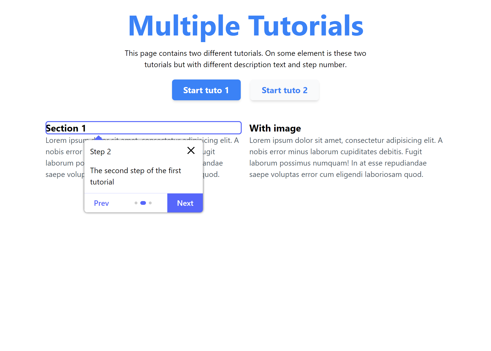

# TutoBox

### Tooltip Screeshot

### HelpBox Screeshot

## User onboarding library

TutoBox is a library that allows you to add tutorials to your web application to show your users step by step how to do something.

Please read the [documentation](https://BOCOVO.github.io/tutobox-site/) to check how to use it.
